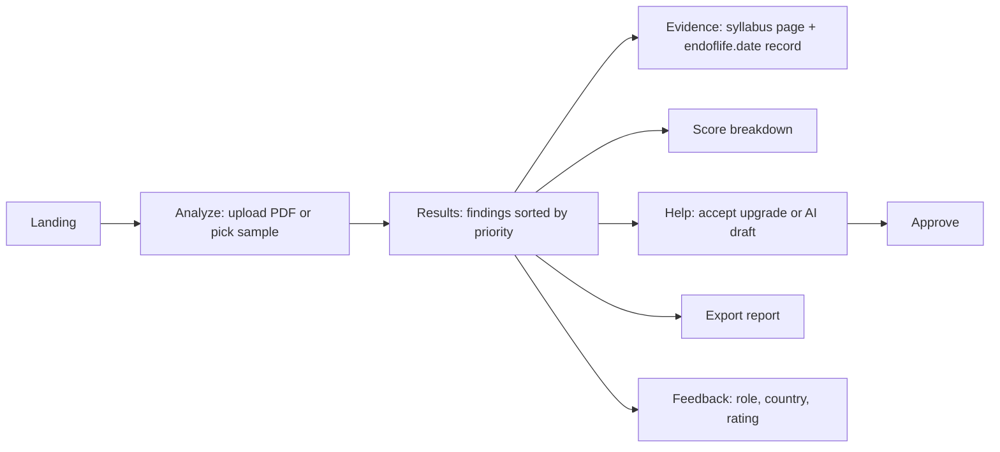

# User flow

```mermaid
flowchart LR
    L[Landing] --> A[Analyze: upload PDF or pick sample]
    A --> R[Results: findings sorted by priority]
    R --> E[Evidence: syllabus page + endoflife.date record]
    R --> S[Score breakdown]
    R --> H[Help: accept upgrade or AI draft]
    H --> P[Approve]
    R --> X[Export report]
    R --> F[Feedback: role, country, rating]
```

Screenshots go in `docs/screenshots/` (add them after the UI is finalized).
